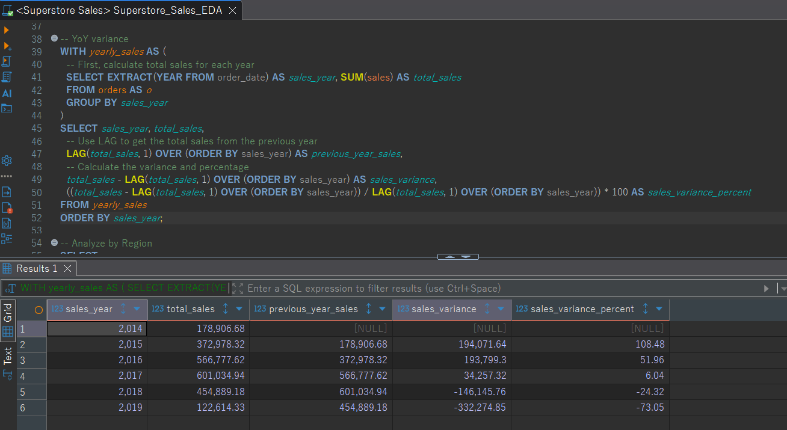
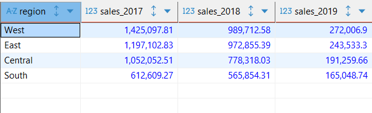
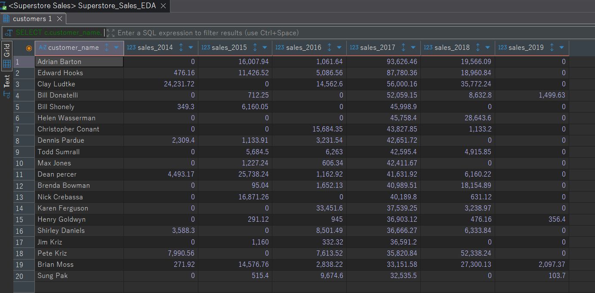
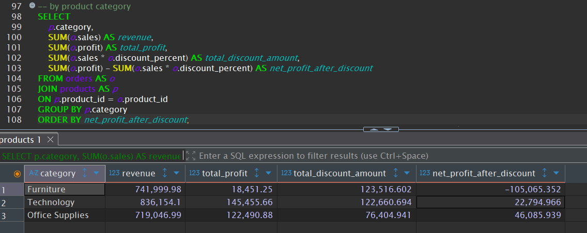
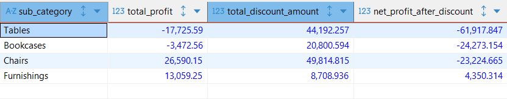
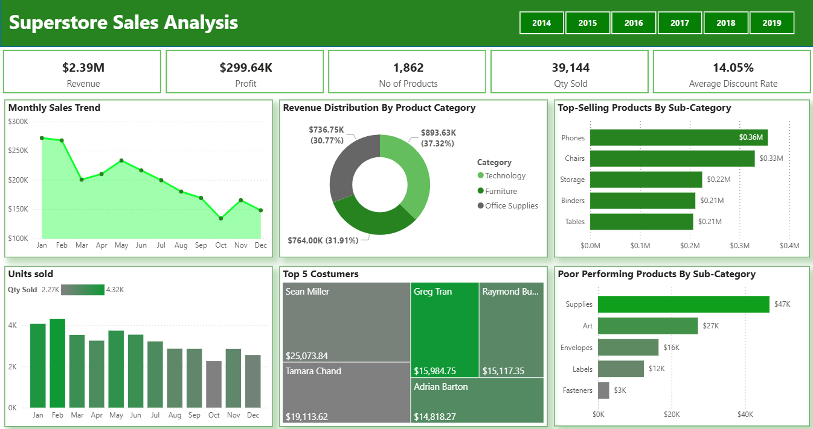
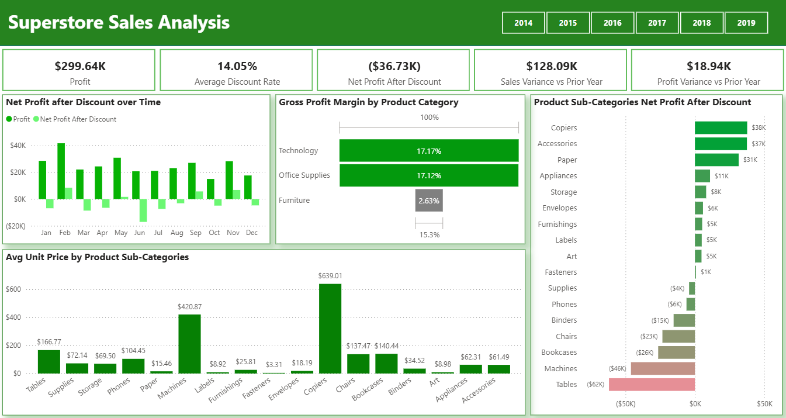
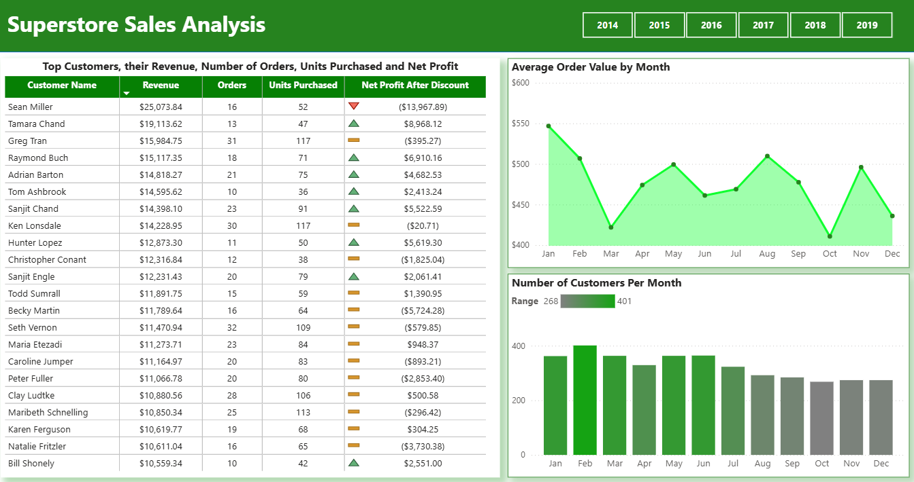

## Superstore Sales Performance Analysis

### Introduction
This project involved a comprehensive financial analysis of the Superstore dataset from 2014 to 2019. The primary objective was to investigate the significant decline in sales observed during the final two years of the period.

---

### Tools Used
* **Excel**: For initial data preparation and cleaning.
* **PostgreSQL**: For database creation, data loading, and querying.
* **Power BI**: For data visualizations.

---

### Project Steps

The following steps were performed to clean the raw data and load it into a PostgreSQL database:

1.  **Data Cleaning & Segmentation:** The raw dataset was processed using **Power Query in Excel** to remove duplicates, standardize data, and split the information into three logical sheets: `orders`, `products`, and `customers`.
2.  **Database Creation:** A new database named `superstore` was created in **PostgreSQL**.
3.  **Data Loading:** The three cleaned Excel sheets were loaded as tables into the `superstore` database. The tables were named `orders`, `products`, and `customers` to reflect their contents.

---

### Methodology
Using **PostgreSQL**, a multi-level analysis was performed to pinpoint the root cause of the sales drop. The analysis progressed from a high-level overview to granular detail, including:
1.  Overall Year-over-Year Variance Analysis
2.  Geographic (Regional) Performance Analysis
3.  Product (Category and Sub-Category) Performance Analysis
4.  Customer Performance Analysis

---

### Initial Overview

#### By YoY variance

* **Growth Phase (2015-2017):** Sales grew steadily and rapidly. In 2015, sales more than doubled, showing a massive 108.48% year-over-year growth. Growth slowed to 51.96% in 2016 and further to 6.04% in 2017, but sales still reached their peak.
* **Decline Phase (2018-2019):** After 2017, the trend reversed dramatically. Sales saw a substantial drop of -24.32% in 2018. The decline accelerated into 2019, with sales plummeting by -73.05%, reaching their lowest point in the dataset.

#### By Region

* West: This region was the top performer in 2017 but saw the largest absolute sales drop, with a decrease of over $1,153,000 by 2019.
* South: This region experienced the most significant percentage decrease, with sales dropping by 73.1% from 2017 to 2019.
* East: While sales declined, the East region showed the most resilience, with the smallest absolute and percentage drop. Sales in this region only dropped by 5.5% between 2017 and 2018.
* Central: Sales in the Central region also declined substantially, dropping by 81.8% from 2017 to 2019.

#### By Customers

* **Significant Customer Churn:** Several key customers who had high sales in 2017, such as Adrian Barton, Edward Hooks, and Clay Ludtke, had little to no sales in the final years of the dataset. This indicates a significant loss of business from the most important clients.
* **Widespread Decline:** The trend is widespread, affecting most of the top 20 customers. The combined sales from these customers, which were substantial in 2017, dropped precipitously in 2018 and 2019, mirroring the overall company-wide trend.
* **Outliers:** A few customers, like Pete Kriz, showed an increase in sales from 2017 to 2018, which is a rare positive trend. However, even their sales did not prevent the overall decline.

#### By Product Category
* **Technology:** This was the top-performing category in 2017 but also experienced a dramatic decline. Sales dropped by over $178,000, which represents a 79% decrease from 2017 to 2019.
* **Office Supplies:** This category showed a similar pattern, with sales falling by over $172,000. This is an 83% decrease from 2017 to 2019.
* **Furniture:** Sales for furniture also declined sharply, dropping by over $151,000. This represents a 76% decrease over the two-year period.
---

### Deeper Analysis
A review of core financial indicators highlighted a significant discrepancy. Although the company maintains a solid Gross Profit Margin, an investigation into discounts showed that high-volume discounting is severely impacting the final Net Profit After Discount. A series of deep-dive queries were then used to pinpoint the source of the issue.

I decided to run further queries to find out which categories or products have the highest discount rates and are contributing the most to this loss.

### By Product Category

The query results confirm that the **Furniture category** is the primary driver of the company's net loss.

**Key Observations 💡**
* The Furniture category generated a total profit of $18,451.25.
* However, the total discount amount applied to this category was a massive $123,516.60.
* This disparity resulted in a net loss of -$105,065.35 for the furniture category alone.
* The Technology and Office Supplies categories are both profitable even after considering discounts. The net loss is entirely concentrated in the Furniture category.

### By Product Sub-Category

The sub-category results reveal that Tables and Bookcases are the biggest contributors to the losses within the Furniture category.

**Key Observations 🧐**
* The Tables sub-category not only has a high total discount amount ($44,192.26) but is also the only one that shows a negative total profit (-$17,725.59) before discounts. This is the most critical issue, as these products are sold at a loss from the start.
* Bookcases also have a negative profit before discounts (-$3,472.56), compounding the problem.
* Chairs show a profit before discounts ($26,590.15), but the heavy discounts ($49,814.82) turn it into a loss.
* Only Furnishings is profitable, both before and after discounts.

---

### Screenshots from Dashboard

### Dashboard Overview

### Profitability Analysis

### Customer Insights

---

### Conclusion
The company's significant decline in sales and profitability is a result of two major, interconnected issues identified through a deep-dive analysis.

1. Profitability and Product Strategy
A detailed examination of sales and profit margins revealed that the Furniture category is the primary driver of the company’s net loss. Specifically, the analysis found that:
* Tables and Bookcases are fundamentally unprofitable products, as they are sold at a loss even before discounts.
* Chairs are made unprofitable due to an aggressive and unsustainable discounting strategy.

2. Widespread Customer Churn
A separate analysis of customer trends showed a critical loss of business from key customers. This widespread decline, which mirrored the overall company trend, was characterized by:
* Significant churn among key customers who had high sales in 2017 but had little to no sales in subsequent years.
* A precipitous drop in combined sales from the top 20 customers between 2017 and 2019.
* The positive sales trends from a few outlier customers were not enough to offset the overall decline.

---

### Recommendations

1. Product Strategy & Pricing
* Rethink Pricing for Tables and Bookcases: These products are sold at a loss before discounts. Conduct a full review of their pricing model and costs to determine if they can be made profitable. If not, consider phasing them out.
* Revise Discounting for Chairs: The current discounting strategy on chairs is unsustainable. I advise implementing a new policy that caps discounts to ensure a minimum profit margin is maintained.
* Leverage Profitable Products: Identify the profitable sub-categories like Furnishings and develop a strategy to increase sales of these items.

2. Customer Retention & Sales
* Investigate Customer Churn: Conduct an in-depth analysis or reach out to former high-volume customers to understand why they stopped purchasing. The insights gained can inform a new retention strategy.
* Implement a Customer Retention Plan: Focus sales efforts on retaining and growing relationships with the most valuable customers. Consider loyalty programs or dedicated account managers for key clients.
* Study Successful Outliers: Analyze the sales data and engagement patterns of the few customers who showed growth. Replicate the strategies that worked for them to re-engage other declining accounts.
